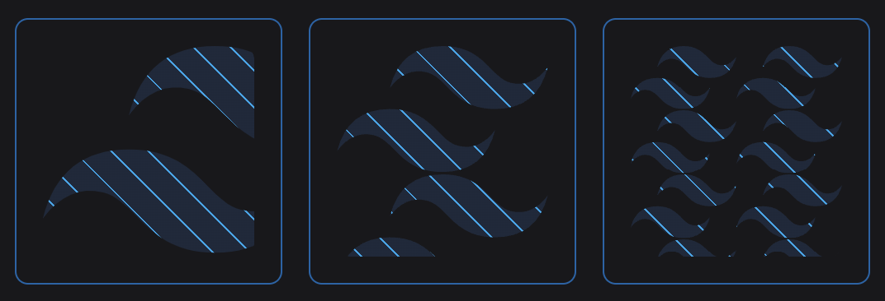

# @pyncz/tailwind-mask-image

A `mask-image` plugin for [Tailwind CSS](https://tailwindcss.com).

[](https://play.tailwindcss.com/5nqePqTxTt)

---

## Install

Install the package with your preferred package-manager.
```
pnpm install @pyncz/tailwind-mask-image
```

After that, simply add the plugin into your `tailwind.config.js`:

```js
// tailwind.config.js
module.exports = {
  // ...
  plugins: [
    // ...
    require('@pyncz/tailwind-mask-image')
  ],
}
```


## Usage

There are 3 default values the `mask` utility can accept:
- `linear`
- `radial`
- `none`


### `linear`

Applies a `linear-gradient` as the mask image. Opacity is set from 100% at the start to 0% at the end, by default.

```html
<div class="mask-linear" />
```


#### Direction `mask-dir`

By default, the gradient is [directed](https://developer.mozilla.org/en-US/docs/Web/CSS/gradient/linear-gradient#values) to bottom. You can easily customize the direction with `mask-dir` utility, including arbitary values.

```html
<div class="mask-linear mask-dir-to-t" />
<div class="mask-linear mask-dir-to-tl" />
<div class="mask-linear mask-dir-[10deg]" />
```


#### Opacity Stops

The `stops` API is similar to tailwind's [Gradient Color Stops](https://tailwindcss.com/docs/gradient-color-stops) core utils, so you can customize your linear mask in a familiar way.

**But!** An important difference is that here you should use not `colors` but `opacity` values.

The `opacity` values are taken from your theme specified in the `tailwind.config.js`, but you obviously can use arbitary opacity values as well.

```html
<div class="mask-linear mask-from-50 mask-to-[0.1]" />
<div class="mask-linear mask-from-0 mask-via-20" />
<div class="mask-linear mask-from-0 mask-via-100 mask-to-50" />
```


> **Note**
> You don't have to specify **all** the stops, because the default values (100% for the start and 0% for the end point) still work.


### `radial`

Applies a `radial-gradient` as the mask image. Like for the `mask-linear` util, the gradient is spread from 100% opacity at the center to 0% at the ending shape.

```html
<div class="mask-radial" />
```


#### Shape `mask-shape`

[Shape](https://developer.mozilla.org/en-US/docs/Web/CSS/gradient/radial-gradient#values) of the gradient, `ellipse` (by default) or `circle`.

```html
<div class="mask-radial mask-shape-ellipse" />
<div class="mask-radial mask-shape-circle" />
```


#### Position `mask-at`

By default, the gradient's position is `center`. You can use the same values as for the [`background-position` css prop](https://developer.mozilla.org/en-US/docs/Web/CSS/background-position#syntax) (`top`, `bottom left` etc), as well as arbitary values with explicit position.

```html
<div class="mask-radial mask-at-[30px_40px]" />
```


#### Size `mask-size`

With this util you can specify the size of the gradient.

```html
<div class="mask-radial mask-size-closest-side" />
<div class="mask-radial mask-size-closest-corner" />
<div class="mask-radial mask-size-farthest-side" />
<div class="mask-radial mask-size-farthest-corner" />
```


Besides *as-they-are* keyword-values, there are also a couple of aliases:
- `mask-size-contain` for `closest-side`
- `mask-size-cover` for `farthest-corner`

You can also use arbitary values:

```html
<div class="mask-size-[40%_2rem] mask-radial" />
<div class="mask-size-[40%_150%] mask-radial" />
```


#### Stops

> **Note**
> The opacity stops are the same as [the ones described for `mask-linear`](#opacity-stops).

```html
<div class="mask-radial mask-from-0 mask-via-[0.25]" />
<div class="mask-radial mask-from-0 mask-via-[0.75] mask-to-100" />
```


### `none`

This value matches `mask-image` css prop's default value so it makes no sense to use it *separately*, but it may be pretty useful if you apply the mask responsively.

```html
<div class="mask-linear sm:mask-none" />
```


### Arbitary values

#### Images

The `mask-image` css prop accepts not only gradients but images as well. You can use arbitary values, for example, to apply `url()` as the mask image.

```html
<div class="mask-[url('/your-pretty-image.png')]" />
```


In this case you can manage the [`mask-repeat` css property](https://developer.mozilla.org/en-US/docs/Web/CSS/mask-repeat) as well with the `mask-repeat` and `mask-no-repeat` utils.

```html
<div class="mask-[url('/your-pretty-image.png')] mask-repeat sm:mask-no-repeat" />
```


#### Gradients

You can pass other types of the gradients, e.g. `conic-gradient` etc.

```html
<div class="mask-[conic-gradient(from_45deg,_black,_transparent)]" />
```


Also, you may want not to use the API above even for `linear-gradient` or `radial-gradient` so you can pass them arbitrarily too.

```html
<div class="mask-[linear-gradient(12deg,_black,_transparent)]" />
```
